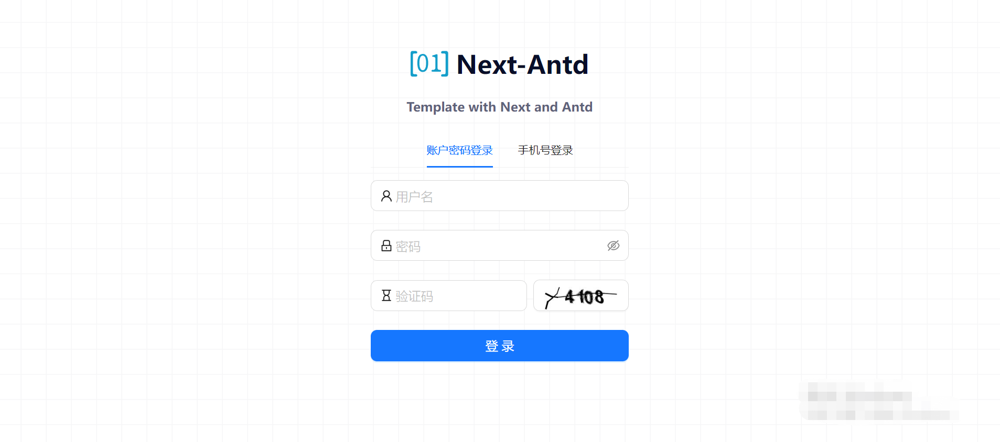

<div align="center">


<h1 align="center">Next-Antd-Template</h1>

English / [简体中文](./README_CN.md)

[Demo](https://openbytecode.com/open-idea) / [Issues](https://github.com/lijunping365/Open-Idea-Web/issues) / [Read docs](https://openbytecode.com/project/open-idea/docs/quick-start)

[演示](https://openbytecode.com/open-idea) / [反馈](https://github.com/lijunping365/Open-Idea-Web/issues) / [邮箱](openbytecode@outlook.com) / [官网](https://openbytecode.com/)



<div align="center"><strong>Next.js 14 Admin Dashboard Template</strong></div>
<div align="center">Built with the Next.js Page Router</div>

</div>

## 概览

这是一个使用以下技术栈的starter模板:

- Framework - [Next.js 14](https://nextjs.org/14)
- Language - [TypeScript](https://www.typescriptlang.org)
- Components - [Ant Design 5](https://ant-design.antgroup.com/index-cn)
- - Style - [Tailwind CSS](https://tailwindui.com/)
- Linting - [ESLint](https://eslint.org)
- Formatting - [Prettier](https://prettier.io)

该模板使用新的 Next.js Page Router。该模板提供仪表板布局，支持主题切换等。

> 提示!
>
> 1. 我们对 antd table 的分页请求进行了封装，你可以使用我们提供的 hooks 轻松完成 table 分页请求。
> 
> 2. 提供用户登录之后全局获取用户信息的 context。
> 
> 3. 可以使用我们提供的主题 context 轻松获取 theme 或修改主题。

1. 登录页面(light):


2. 登录页面(dark):


3. dashboard 页面(light):


4. dashboard 页面(collapsed):


5. dashboard 页面(dark):


6. 用户列表页面(dark):


## 快速开始

使用该模板创建一个项目。

最后，运行以下命令启动：

```shell
pnpm install

npm run dev
```

现在您应该可以通过以下网址访问应用程序： http://localhost:3000.


### 贡献指南

[Contributors](https://github.com/lijunping365/Next-Antd-Template/graphs/contributors)

## LICENSE

[Apache License](./LICENSE)
